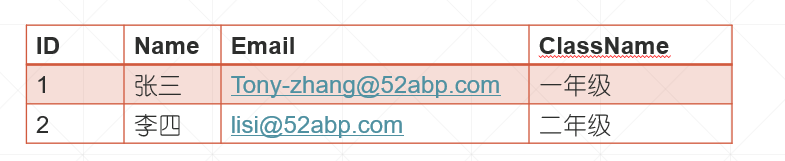

# 目录

> 本文出自[《从零开始学 ASP.NET CORE MVC》目录](https://www.52abp.com/wiki/mvc/0.1.4/1.Intro) </br>
> 视频课程效果更佳：[从零开始学 Asp.Net Core MVC](https://study.163.com/course/courseMain.htm?courseId=1209215803&share=2&shareId=400000000309007) </br>

# 在 ASP.NET Core MVC 中实现 List 视图。

让我们通过一个示例来理解这一点。我们想要查询所有员工信息并将其显示在网页上，如下所示
。目前，从美观的角度来看，页面看起来并不那么好。





> 在我们即将发布的本系列视频中，我们将安装 Bootstrap 并设置页面样式以使其看起来好看些。

## IStudentRepository- 代码修改

修改 IStudentRepository 接口以包含 GetAllStudents()方法。如您所见，此方法返回所有学生的列表信息。

```
 public interface IStudentRepository    {
        Student GetStudent(int id);
        IEnumerable<Student> GetAllStudents();
    }
```

## 更改 MockStudentRepository- 代码

目前，在我们的应用程序中，我们只有一个实现 IStudentRepository 接口的类（MockStudentRepository）。
因此修改 MockStudentRepository 类文件，将 GetAllStudents()方法实现，
如下所示。注意，GetAllStudents()返回我们在私有字段**\_studentList** 中拥有的硬编码学生列表。

在我们即将发布的视频中，我们将为 IStudentRepository 接口提供另一种实现。此新实现将从 SQL Server 数据库中查询学生信息。

```csharp
    public class MockStudentRepository : IStudentRepository
    {
        private readonly List<Student> _studentList;

        public MockStudentRepository()
        {
            _studentList = new List<Student>
            {
                new Student {Id = 1, Name = "张三", ClassName = "一年级", Email = "Tony-zhang@52abp.com"},
                new Student {Id = 2, Name = "李四", ClassName = "二年级", Email = "lisi@52abp.com"},
                new Student {Id = 3, Name = "王二麻子", ClassName = "二年级", Email = "wang@52abp.com"}
            };
        }
        public Student GetStudent(int id)
        {
            return _studentList.FirstOrDefault(a => a.Id == id);
        }
        public IEnumerable<Student> GetAllStudents()
        {
            return _studentList;
        }

    }
```

## HomeController 的代码变化

修改，HomeController 中的 Index()方法,如下所示。
请注意，我们通过调用 GetAllStudents()方法查询学生列表，并将该列表传递给 View。

```csharp
public class HomeController : Controller
    {
        private readonly IStudentRepository _studentRepository;

        // 使用构造函数注入的方式注入IStudentRepository
        public HomeController(IStudentRepository studentRepository)
        {
            _studentRepository = new MockStudentRepository();
        }

        //返回学生的名字
        public ViewResult Index()
        {
            //查询所有的学生信息
            var model = _studentRepository.GetAllStudents();
            //将学生列表传递到视图
            return View(model);
        }

        public ViewResult Details()
        {
            //实例化HomeDetailsViewModel并存储Student详细信息和PageTitle
            HomeDetailsViewModel homeDetailsViewModel = new HomeDetailsViewModel()
            {
                Student = _studentRepository.GetStudent(1),
                PageTitle = "Student Details"
            };

            // 将ViewModel对象传递给View()方法
            return View(homeDetailsViewModel);
        }
    }
```

## Index.cshtml - 代码更改

设置 **IEnumerable<StudentManagement.Models.Student>**作为使用@model 指令的视图的模型
使用 foreach 循环遍历学生列表中的每个学生，并动态生成表行和表单元格以显示 ID，Name 和 ClassName 属性值。

```csharp
@model IEnumerable<StudentManagement.Models.Student>
<!DOCTYPE html>
<html>
<head>
    <title>学生页面详情</title>
</head>
<body>

<table>
    <thead>
    <tr>
        <th>ID</th>
        <th>名字</th>
        <th>班级名称</th>
    </tr>
    </thead>
    <tbody>
    @foreach (var student in Model)
    {
        <tr>
            <td>
                @student.Id
            </td>
            <td>
                @student.Name
            </td>
            <td>
                @student.ClassName
            </td>
        </tr>
    }
    </tbody>
</table>

</body>
</html>
```

# 文章说明

> 如果您觉得我的文章质量还不错，欢迎打赏，也可以订阅我的视频哦 </br>
> 未得到授权不得擅自转载本文内容,52abp.com 保留版权 </br>
> 【收费】腾讯课堂:[https://ke.qq.com/course/392589?tuin=2522cdf3](https://ke.qq.com/course/392589?tuin=2522cdf3) </br>
> 【免费】youtube 视频专区：[http://t.cn/Ei0F2EB](http://t.cn/Ei0F2EB) </br>
> 感谢您对我的支持

## 关注微信公众号：角落的白板报


