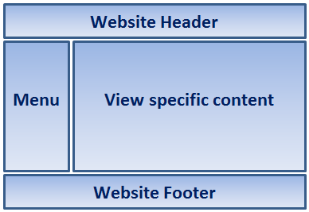

# 目录

> 本文出自[《从零开始学 ASP.NET CORE MVC》目录](https://www.52abp.com/wiki/mvc/0.1.4/1.Intro) </br>
> 视频课程效果更佳：[从零开始学 Asp.Net Core MVC](https://study.163.com/course/courseMain.htm?courseId=1209215803&share=2&shareId=400000000309007) </br>

在本视频中，我们将讨论 ASP.NET Core MVC 中的布局视图

# 为什么需要布局视图

大多数 Web 应用程序网站通常都有以下部分组成

- Header-头部
- Footer-页脚
- Menu-导航菜单
- View-具体内容的视图



如果没有布局视图，我们将在 Web 程序中的每个视图中，重复显示很多 HTML 代码，比如菜单栏，导航信息，关于我们，footer 页脚等等。
在每个视图中都有这个重复的 HTML，这样维护我们的 Web 程序，是一场灾难，996ICU 不是梦。
例如，我们必须在导航菜单中添加或删除菜单项或更改页眉或页脚。
我们必须在每个视图中进行此更改，这显然是单调乏味，单调，耗时且容易出错，想想你如果有 400 个视图会怎么样。
我们可以在布局视图中定义它们，然后在所有视图中继承该外观，而不是在每个视图中都包含所有这些部分。

使用布局视图，在所有视图中保持一致的外观变得更加容易，因为我们只有一个要修改的布局视图文件，如果有任何更改。然后更改后将立即反映在整个应用程序的所有视图中。

## ASP.NET Core MVC 中的布局视图

- 就像常规视图一样，布局视图也具有`.cshtml` 扩展名的文件
- 您可以将布局视图视为 ASP.NET Web Form 中的母版页。
- 由于布局视图不特定于控制器，我们通常放在“Views”文件夹的子文件夹“Shared”中。
- 默认情况下，在 ASP.NET Core MVC 中，布局视图文件名为`\_Layout.cshtml`。
- 在 ASP.NET Core MVC 中，有一些视图文件，如布局的视图，\_ViewStart.cshtml 和\_ViewImports.cshtml 等其他.cshtml 文件的文件名以下划线开头
- 这些文件名中的前下划线表示这些文件不是直接面向浏览器。

- 也可以在单个应用程序中包含多个布局视图文件。比如一个布局视图文件服务为管理员用户，另外一个不同的布局视图文件服务于普通用户。

## 创建布局视图

- 右键单击**Views**文件夹并添加“Shared”文件夹。
- 右键单击“**Shared**”文件夹，然后选择“添加” - “新建项”
- 在“添加新项”窗口中搜索布局,一般在 web 下的 asp.net

- 选择“Razor 布局”并单击“添加”按钮
- 名为\_Layout.cshtml 的文件将添加到“Shared”文件夹中
- \_Layout.cshtml 文件中自动生成的 HTML

以下是\_Layout.cshtml 中默认生成的 HTML 。

```html
<!DOCTYPE html>
<html>
  <head>
    <meta name="viewport" content="width=device-width" />
    <title>@ViewBag.Title</title>
  </head>
  <body>
    <div>
      @RenderBody()
    </div>
  </body>
</html>
```

请注意，标准**html**，**head**，**title**和**body**元素位于此布局视图文件中。由于我们现在将它们放在布局视图文件中，因此我们不必在每个视图中重复所有这些 HTML。

目前，我们没有导航菜单。我们将在即将推出的视频中将其包含在布局视图中。

使用`@ViewBag.Title`表达式查看特定标题。
例如，当使用此布局视图呈现“index.cshtml”视图时，index.cshtml 将在 ViewBag 上设置 Title 属性。

然后，使用表达式@ViewBag.Title 通过布局视图检索它，并将其设置为`<title>`标记的值。

ViewBag 不提供智能提示和编译时错误检查。因此，使用它将大量数据从普通 Razor 视图传递到布局视图并不是很好，但是传递像 PageTitle 这样非常小的东西，ViewBag 就很合适了。

`@RenderBody()`是注入视图特定内容的位置。例如，如果使用此布局视图呈现 index.chtml 视图，则会在我们 调用`@RenderBody()`方法 的位置注入 `index.cshtml` 视图内容 。

## 使用布局视图

要使用布局视图`（\_Layout.cshtml）`渲染视图，需设置 Layout 属性。例如，要将布局视图与 details.cshtml 一起使用，需要修改 details.cshtml 中的代码以包含 `Layout` 属性，如下所示。

```html
@model StudentManagement.ViewModels.HomeDetailsViewModel @{ Layout =
"~/Views/Shared/_Layout.cshtml"; ViewBag.Title = "Student Details"; }
<h3>@Model.PageTitle</h3>
<div>
  姓名 : @Model.Student.Name
</div>
<div>
  邮箱 : @Model.Student.Email
</div>
<div>
  班级名称 : @Model.Student.ClassName
</div>
```

我们有一种更好的方法来设置 Layout 属性，而不是在每个视图中设置它。
我们将在即将发布的视频中讨论这个问题

# 文章说明

> 如果您觉得我的文章质量还不错，欢迎打赏，也可以订阅我的视频哦 </br>
> 未得到授权不得擅自转载本文内容,52abp.com 保留版权 </br>
> 【收费】腾讯课堂:[https://ke.qq.com/course/392589?tuin=2522cdf3](https://ke.qq.com/course/392589?tuin=2522cdf3) </br>
> 【免费】youtube 视频专区：[http://t.cn/Ei0F2EB](http://t.cn/Ei0F2EB) </br>
> 感谢您对我的支持

## 关注微信公众号：角落的白板报


