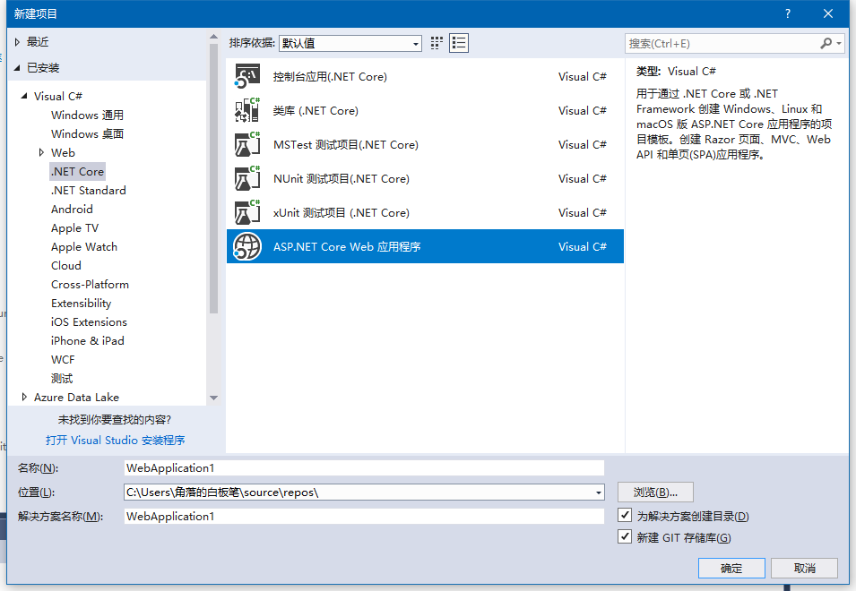
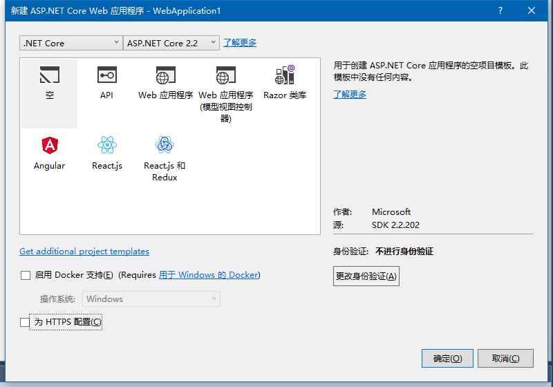
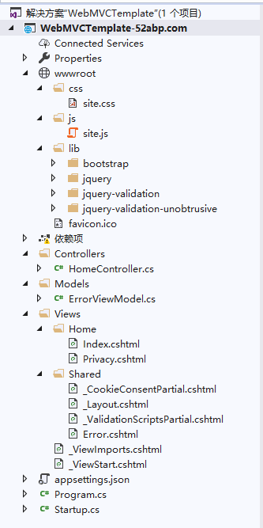
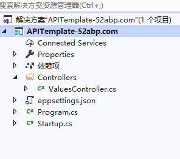

# 目录

> 本文出自[《从零开始学 ASP.NET CORE MVC》目录](https://www.52abp.com/wiki/mvc/0.1.4/1.Intro)  
> 视频课程效果更佳：[从零开始学 Asp.Net Core MVC](https://study.163.com/course/courseMain.htm?courseId=1209215803&share=2&shareId=400000000309007)  

# 创建 ASP.NET Core Web 应用程序

> 如果您使用的是 VS2019 请看 [VS2019 创建 ASP.NET Core Web 程序(三)](https://www.jianshu.com/p/be05ec3c64bb)

## 在这个视频中我们将讨论

- 可用的不同项目模板及其功能
- 预制的项目模板有什么不同，哪些是可以使用的，以及他们的作用。

## 在 Visual Studio2017 中创建新的 ASP.NET Core 项目

步骤 1：在 Visual Studio 2017 中创建新的 asp.net Core 项目

步骤 2：在 Visual Studio 中单击文件 - 新建 - 项目。

第 3 步：在“新建项目”对话框中，展开 “已安装”。然后展开“Visual C＃”并 选择.NET Core

第 4 步：在中间窗格中，您将找到所有已安装的项目模板。例如，您将找到用于创建.NET 控制台应用程序，类库，单元测试项目（使用 MSTest，NUnit 或 xUnit 框架），ASP.NET Core Web 应用程序的模板 。

第 5 步：

我们想要创建“ASP.NET Core Web 应用程序”。因此，选择“ASP.NET Core Web 应用程序”

第 6 步：在“名称”文本框中，键入项目的名称。我将其命名为`StudentManagement`。
我们将创建一个 asp.net core web 应用程序，在这个程序中，我们将创建、读取、更新、删除学生。

第 7 步：另外，指定要创建此项目的位置。我将把我的项目放在,路径为,C：\Projects\source\repos 文件夹中。

第 8 步: 在下一个屏幕上，选择 ASP.NET Core 2.2（此录制时可用的最新.NET Core SDK）

第 9 步：取消选中“为 HTTPS 配置”复选框 ，如上图所示，关闭身份验证。

此屏幕显示可用于创建 ASP.NET Core 应用程序的不同项目模板。

## 各个模板简单说明

空：名称暗示的“空”模板不包含任何内容。这是`我们将使用的模板`，**并从头开始手动设置所有内容，以便我们清楚地了解不同部分如何组合在一起**。

Web 应用程序（模型视图控制器）:此模板包含创建 Model，视图(Views)和控制器文件夹并添加 Web 特定的内容，如 CSS，JavaScript 文件，布局文件和网站所需的其他资源，也可以基于此模板创建 Restful 风格的 HTTP 服务。

下面的屏幕截图显示了我使用`Web应用程序（模型视图控制器）`创建的项目。请注意，我们有**Modes，Views 和 Controllers 文件夹**。在 Views 文件夹中，我们有示例视图文件和布局文件，它们代表 Web 应用程序的用户界面。我们还有 Web 应用程序通常需要的 JavaScript 和 CSS 文件。

 

API：此模板包含创建 ASP.NET Core RESTful HTTP 服务所需的一切

AP I 不需要所有网站特定的内容，如 JavaScript 文件，CSS 文件，视图文件，布局文件，因为它没有用户界面。Web API 公开的数据通常由其他应用程序使用,可以简单的理解为 程序和程序之间打交道。

因此，API 模板只会创建**Controllers**文件夹。它不会创建 **Models 和 Views**文件夹，因为它们不是 API 所必需的。下面的屏幕截图显示了我使用 API 模板创建的项目。请注意，我们只有**Controllers**文件夹。我们没有 RESTful API 不需要的所有 JavaScript，CSS 和布局文件。

Web 应用程序：此模板使用新的用于构建 Web 应用程序的 RazorPages 框架。使用 Razor 页面，编写以页面为中心的场景更容易，更高效。当我们不想要 ASP.NET MVC 的完整复杂性时，我们通常使用这种方法。我们可以将其视为 MVC 框架的更薄版本。我们将在即将发布的视频中详细讨论 RazorPages。

Razor 类库（RCL）：顾名思义，我们使用此模板创建可复用的 Razor 类库项目。该项目包含所有可复用的用户界面部分，如数据模型，页面模型，控制器，页面，Razor 视图和 View 组件。然后，可以在多个应用程序中复用此 Razor 类库（RCL）项目。任何使用 RCL 的应用程序都可以覆盖它包含的视图和页面。我们将在后面发布的视频中讨论 RCL。

Angular，React.js，React.js 和 Redux：这三个模板允许我们与 Angular，React 或 React 和 Redux 一起创建 asp.net Core Web 应用程序。

在下一篇文章中，我们将探索和理解 ASP.NET Core 项目文件。

## 摘要

在本文中，我尝试解释如何使用从头开始的创建项目，以及不同类型的模板的区别。我希望这篇文章可以帮助您满足您的需求。我想收到你的反馈意见。请发布您对本文的反馈，问题或意见。

# 文章说明

> 如果您觉得我的文章质量还不错，欢迎打赏，也可以订阅我的视频哦  
> 未得到授权不得擅自转载本文内容,52abp.com 保留版权  
> 【收费】腾讯课堂:[https://ke.qq.com/course/392589?tuin=2522cdf3](https://ke.qq.com/course/392589?tuin=2522cdf3)  
> 【免费】youtube 视频专区：[http://t.cn/Ei0F2EB](http://t.cn/Ei0F2EB)  
> 感谢您对我的支持

## 关注微信公众号：角落的白板报

