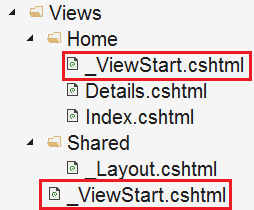

# 目录

> 本文出自[《从零开始学 ASP.NET CORE MVC》目录](https://www.52abp.com/wiki/mvc/0.1.4/1.Intro) </br>
> 视频课程效果更佳：[从零开始学 Asp.Net Core MVC](https://study.163.com/course/courseMain.htm?courseId=1209215803&share=2&shareId=400000000309007) </br>

# 什么是\_ViewStart.cshtml 文件

在这个视频中，我们将讨论什么是\_ViewStart.cshtml 文件，它在 ASP.NET Core MVC 中如何使用。

# 设置 Layout 属性

我们使用 Layout 属性将视图与布局视图相关联。没有`\_ViewStart.cshtml` 文件，我们需要在每个视图中的设置 Layout 属性。
这违反了 DRY (Don't Repeat Yourself)原则，并具有以下缺点:

- 冗余代码。
- 维护成高。

如果要使用其他布局文件，还需要更新每个视图。这工程不仅是繁琐且耗时，而且还容易出错，想想你有 400 个视图文件其中 200 个要改。

# ASP.NET Core MVC 中的\_ViewStart.cshtml 文件是什么

它是 ASP.NET Core MVC 中的一个特殊文件。此文件中的代码在调用单个视图中的代码之前先执行。
所以这意味着，我们可以将该公共代码移动到`\_ViewStart.cshtml`文件中，而不是在每个单独的视图中设置 Layout 属性。

```
@{
    Layout = "_Layout";
}
```

通过在`\_ViewStart.cshtml` 文件中设置 Layout 属性，维护我们的应用程序变得更加容易。将来，如果我们想要使用不同的布局文件，我们只需要在`\_ViewStart.cshtml` 中的一个位置更改代码。

## \_ViewStart.cshtml 文件支持分层

我们通常将 **ViewStart** 文件放在 **Views** 文件夹中。由于此文件支持分层 ，我们也可以将它放在 **Views** 文件夹中的任何子文件夹中。



在上面的文件夹结构中，我们在 `Views`文件夹中放置了一个 `ViewStart` 文件，在 `Home` 子文件夹中放置了另一个 `ViewStart` 文件。

**Home** 子文件夹中 `ViewStart` 文件中指定的布局页面,将覆盖 **Views** 文件夹中 `ViewStart` 文件中指定的布局页面。

这意味着，**Views** 文件夹中的所有视图都将使用 **Views** 中 `ViewStart` 文件中指定的布局页面，但 Home 文件夹中的视图将使用 Home 文件夹中 ViewStart 文件中指定的布局页面。

请注意：如果要使用与`\_ViewStart.cshtml` 中指定的布局文件不同的布局文件，可以通过在单个视图中设置 Layout 属性来实现。

如果希望在没有布局视图的情况下渲染视图，也可以将 Layout 属性设置为 null。

## 逻辑判断调用布局视图

在 ASP.NET Core MVC 应用程序中，我们可以有多个布局视图。比方说，我们的应用程序中有以下 2 个布局视图。

```
 _AdminLayout.cshtml
_NonAdminLayout.cshtml
```

在`\_ViewStart.cshtml` 中可以通过逻辑判断登录用户角色来选择对应的布局视图

```csharp
@{
    if (User.IsInRole("Admin"))
    {
        Layout = "_AdminLayout";
    }
    else
    {
        Layout = "_NonAdminLayout";
    }
}
```

# 文章说明

> 如果您觉得我的文章质量还不错，欢迎打赏，也可以订阅我的视频哦 </br>
> 未得到授权不得擅自转载本文内容,52abp.com 保留版权 </br>
> 【收费】腾讯课堂:[https://ke.qq.com/course/392589?tuin=2522cdf3](https://ke.qq.com/course/392589?tuin=2522cdf3) </br>
> 【免费】youtube 视频专区：[http://t.cn/Ei0F2EB](http://t.cn/Ei0F2EB) </br>
> 感谢您对我的支持

## 关注微信公众号：角落的白板报


