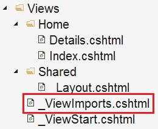
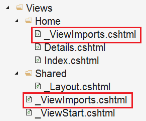

# 目录

> 本文出自[《从零开始学 ASP.NET CORE MVC》目录](https://www.52abp.com/wiki/mvc/0.1.4/1.Intro) </br>
> 视频课程效果更佳：[从零开始学 Asp.Net Core MVC](https://study.163.com/course/courseMain.htm?courseId=1209215803&share=2&shareId=400000000309007) </br>

# ASP.NET Core MVC 中的\_ViewImports.cshtml 文件。

在这个的视频中，我们将讨论 ASP.NET Core MVC 中的`\_ViewImports.cshtml`文件。

`\_ViewImports.cshtml`文件通常放在 Views 文件夹中。它用于包含公共命名空间，因此我们不必在每个视图中来引用这些需要的命名空间。



例如, 如果我们在 Viewimport 文件中包含以下 2 个命名空间, 则这两个命名空间中的所有类型都可用于 "Home" 文件夹中的每个视图, 而无需再次引入完整的命名空间。

```csharp
@using StudentManagement.Models;
@using StudentManagement.ViewModels;

```

> 注意，@using 指令用于包含公共命名空间。除 @using 指令外，\_ViewImports 文件还支持以下指令。

```java
@addTagHelper
@removeTagHelper
@tagHelperPrefix
@model
@inherits
@inject
```

> TagHelpers 是此版本的 MVC 中的新功能。我们将在即将发布的视频中详细讨论它们。

## \_ViewImports 文件是分层的

**\_ViewStart** 文件和**\_ViewImports** 文件均支持分层，除了将它放在 Views 文件夹中之外，我们还可以在 Views 文件夹的“Home”子文件夹中放置另一个\_ViewImports。



在文件 Home 的文件夹中的`\_ViewImports`将覆盖在 Shared 文件夹中的`\_ViewImports`文件指定的设置。

> 请注意：如果在视图中指定了设置，该设置将覆盖文件夹中父`\_ViewImports`文件中的匹配设置。

# 声明

> 如果您觉得我的文章质量还不错，欢迎打赏，也可以订阅我的视频哦 </br>
> 未得到授权不得擅自转载本文内容,52abp.com 保留版权

> 【收费】腾讯课堂:[https://ke.qq.com/course/392589?tuin=2522cdf3](https://ke.qq.com/course/392589?tuin=2522cdf3) </br>
> 【免费】youtube 视频专区：[http://t.cn/Ei0F2EB](http://t.cn/Ei0F2EB) </br>
> 谢谢支持

# 文章说明

> 如果您觉得我的文章质量还不错，欢迎打赏，也可以订阅我的视频哦 </br>
> 未得到授权不得擅自转载本文内容,52abp.com 保留版权 </br>
> 【收费】腾讯课堂:[https://ke.qq.com/course/392589?tuin=2522cdf3](https://ke.qq.com/course/392589?tuin=2522cdf3) </br>
> 【免费】youtube 视频专区：[http://t.cn/Ei0F2EB](http://t.cn/Ei0F2EB) </br>
> 感谢您对我的支持

## 关注微信公众号：角落的白板报


