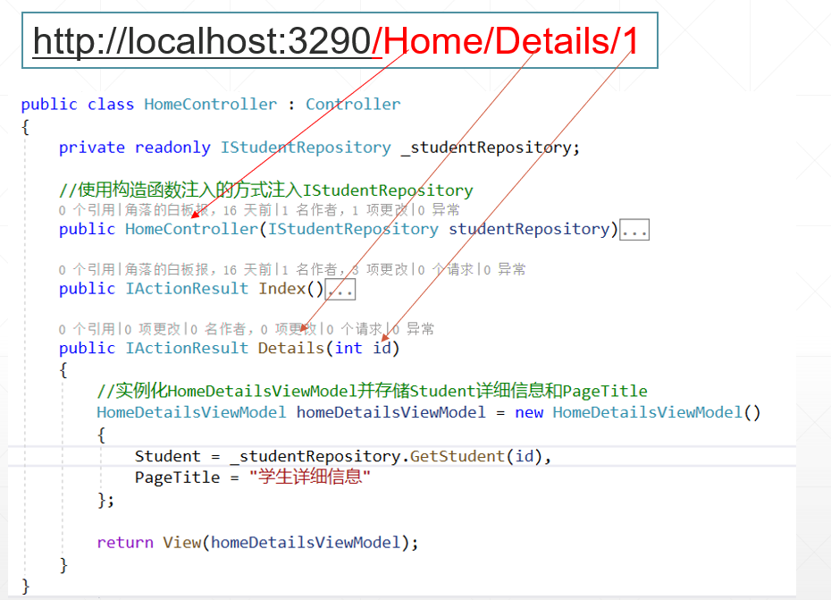
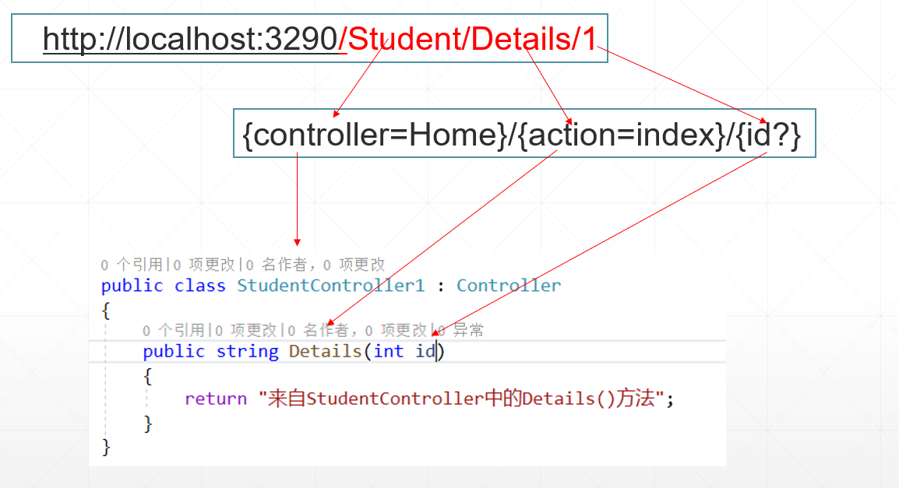

# 目录

> 本文出自[《从零开始学 ASP.NET CORE MVC》目录](https://www.52abp.com/wiki/mvc/0.1.4/1.Intro) </br>
> 视频课程效果更佳：[从零开始学 Asp.Net Core MVC](https://study.163.com/course/courseMain.htm?courseId=1209215803&share=2&shareId=400000000309007) </br>

# ASP.NET Core MVC 中的路由，它和路由器有关系吗？

在本视频中，我们将讨论 ASP.NET Core MVC 中的路由。

ASP.NET Core MVC 中有两种路由技术**常规路由和属性路由**。
在本视频中，我们将讨论常规路由，在下一个视频中，我们将讨论**属性路由**。

当来自浏览器的请求到达我们的应用程序时，MVC 中的控制器会处理传入的 http 请求并响应用户操作，请求**URL**会被映射到控制器的操作方法上。此映射过程是由我们的应用程序中定义的路由规则完成。

例如，当向`/Home/Index` 发出请求时，此**URL**将映射到**HomeController**类中的 Index()操作方法。


类似地，当向/Home/Details/1 发出请求时，此**URL**将映射到**HomeController**类中的**Details()**操作方法。**URL**中的值 1 自动映射到“id”所述 Details(int id)的操作方法。



目前，我们还没有在 ASP.NET Core MVC 应用程序中明确定义任何路由规则。
所以我们想到的问题是，这个**URL**`（/Home/Index）`如何映射到**HomeController**中的 Index()方法。

## ASP.NET Core MVC 中 的默认路由

以下是 `Startup.cs` 文件中 Configure()方法中的代码。
此方法中的代码设置**HTTP 请求处理管道**。
我们在之前的 ASP.NET Core 教程视频中讨论过这种方法。

```csharp
public void Configure(IApplicationBuilder**app, IHostingEnvironment env)
{
    if (env.IsDevelopment())
    {
        app.UseDeveloperExceptionPage();
    }

    app.UseStaticFiles();

    app.UseMvcWithDefaultRoute();
}
```

在这个方法中，我们调用了 `UseMvcWithDefaultRoute()`扩展方法。
正是这种方法将 MVC 与默认路由添加到我们的应用程序的请求处理管道中。

`{controller=Home}/{action=Index}/{id?}`

只需将鼠标悬停在 visual studio 中的 `UseMvcWithDefaultRoute()`上，就可以看到智能提示的默认路由。
另外，ASP.NET Core 是开源项目。因此，您还可以在以下链接的 GITHUB 页面上看到 `UseMvcWithDefaultRoute()`方法的代码。

[https://github.com/aspnet/Mvc/blob/release/2.2/src/Microsoft.AspNetCore.Mvc.Core/Builder/MvcApplicationBuilderExtensions.cs](https://github.com/aspnet/Mvc/blob/release/2.2/src/Microsoft.AspNetCore.Mvc.Core/Builder/MvcApplicationBuilderExtensions.cs)

## UseMvcWithDefaultRoute()方法中的代码

为了您的快速参考，以下是来自的代码在 GITHUB 页面之上。
注意，`UseMvcWithDefaultRoute()`方法在内部调用 `UseMvc()`方法，它设置默认路由。

```csharp
public static IApplicationBuilder**UseMvcWithDefaultRoute(this IApplicationBuilder**app)
{
    if (app == null)
    {
        throw new ArgumentNullException(nameof(app));
    }

    return app.UseMvc(routes =>
    {
        routes.MapRoute(
            name: "default",
            template: "{controller=Home}/{action=Index}/{id?}");
    });
}
```

## 了解默认路由

默认路由模板`{controller=Home}/{action = Index}/{id？}`,大多数的**URL**都会按照这个规则进行映射。

`http://localhost:1234/Student/Details/1`

| 路径段   |             映射信息              |
| -------- | :-------------------------------: |
| /Student |       StudentController 类        |
| /Details |        Details(int id)方法        |
| /1       | Details(int id)操作方法的 id 参数 |



第一个**URL**路径段`/Student`映射到`StudentController`。在**URL**中，我们不必使用 `Controller`这个后缀。当 MVC 在第一个**URL**路径段中找到单词`/Student`时，它会附加单词 `Controller`并查找名 `StudentController`的类。

第二个**URL**路径段`“/Details”`映射到 StudentController**中的**Details（int id）操作方法。

第三个路径段“1”映射到**Details（int id）操作方法的 id 参数。这个步骤被称之为**模型绑定\*\*，我们将在即将发布的视频中详细讨论模型绑定。

请注意，在以下默认路由模板中，我们在 id 参数后面有一个问号。 默认路由模板`“{controller**=**Home}/{action = Index}/{id？}”`，问号使**URL**中的 id 参数可选。
这意味着通过以下**URL**，都可以通过路由映射到 `StudentController`类的`Details`()操作方法中。

```css
/Student/Details/1
/Student/Details
```

{controller**=**Home}中的值“Home”是 Controller\*\*的默认值。类似地，{action = Index}中的值“Index”是 action 方法的默认值。

因此，使用这些默认值，如果我们导航到应用程序根**URL**，如下所示。请注意，在**URL**中我们没有 Controller**和 Action 方法路径段。因此将使用默认值，并且请求将映射到**HomeController**类的 Index()操作方法。
`http://localhost:1234`
以下请求**URL**也将映射到**HomeController\*\*类的 Index()操作方法。

```
http：//localhost：1234/Home
http：//localhost：1234/Home/Index
```

对于大多数应用程序，默认路由工作正常。例如，

```
 public class**DepartmentsController**: Controller
{
    public string List()
    {
        return "List() of**DepartmentsController";
    }

    public string**Details()
    {
        return "Details() of**DepartmentsController";
    }
}
```

**URL**“/departments/list”映射到**DepartmentsController**的 List()操作方法，**URL**“/departments/details”映射到**DepartmentsController**的**Details()**操作方法。

## UseMvc 或 UseMvcWithDefaultRoute

如果要定义自己的路径模板并希望更多地控制路径，请使用 UseMvc()方法，而不是 UseMvcWithDefaultRoute()方法。

```
app.UseMvc（routes =>
{
    routes.MapRoute（“default”，“{controller**=**Home}/{action = Index}/{id？}”）;
}）;

```

# 文章说明

> 如果您觉得我的文章质量还不错，欢迎打赏，也可以订阅我的视频哦 </br>
> 未得到授权不得擅自转载本文内容,52abp.com 保留版权 </br>
> 【收费】腾讯课堂:[https://ke.qq.com/course/392589?tuin=2522cdf3](https://ke.qq.com/course/392589?tuin=2522cdf3) </br>
> 【免费】youtube 视频专区：[http://t.cn/Ei0F2EB](http://t.cn/Ei0F2EB) </br>
> 感谢您对我的支持

## 关注微信公众号：角落的白板报


