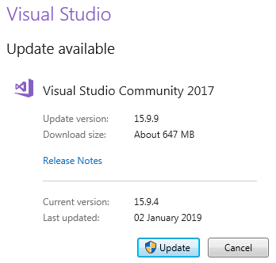
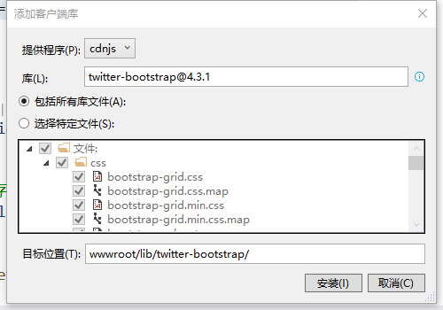
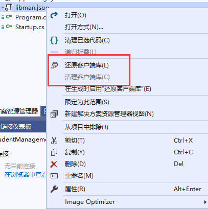
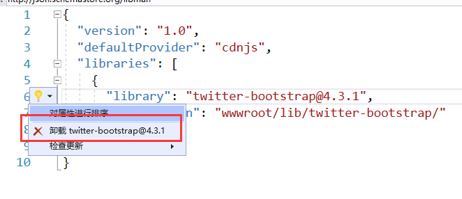
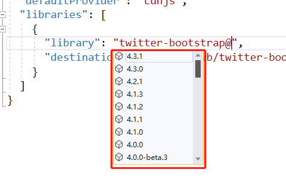

# 在 ASP.NET Core 中安装和使用 Bootstrap

在本章节中，我们将讨论如何在 ASP.NET Core 中安装和使用 Bootstrap

## 客户端包管理工具-LibMan

如果你已经有一些开发经验了，可能知道有很多工具与 Visual Studio 一起安装 Bootstrap 和 jQuery 等客户端软件包。
例如，我们可以使用像 Bower，NPM，WebPack 等工具。 但是，我们不会使用任何这些工具。我们将改为使用**Library Manager (简称 LibMan )**。
Library Manager 是一个轻量级的客户端库管理工具。它可以从文件系统或 CDN（Content Delivery Network-内容交付网络）下载客户端库和框架。

为了能够使用 LibMan，你应该有 Visual Studio 2017 版本 15.8 或更高版本

如果您使用的 Visual Studio 2019，可以忽略。

## 检查 Visual Studio 版本

要检查 Visual Studio 的版本你可以从

- 单击“**帮助**”菜单项和
- 从下拉菜单中选择“**关于 Microsoft Visual Studio**”
- 出现的窗口显示您拥有的 Visual Studio 版本
- 在我的机器上我有 15.9.11


如果您使用的是旧版 Visual Studio 2017，您可以轻松更新它。

## 更新 visual studio 版本

- 单击*“**帮助**”*菜单项和
- 从下拉菜单中选择“**检查更新**”
- 出现的后续窗口显示当前版本和最新可用版本。
- 只需单击“更新”按钮即可



## 使用 LibMan 安装 Bootstrap

- 右键单击 **解决方案资源管理器** 中的“项目名称”，然后选择 添加> 客户端库。
- 在打开的“添加客户端库”窗口中
- 保留默认提供程序 `cdnjs`
- 在“库”文本框中，键入“twitter-bootstrap”。选择匹配的条目后，它会尝试安装最新版本。当然，您可以手动键入所需的版本。它也有智能提示支持。我们将安装 最新版本的 Bootstrap 4.3.1。
- 您可以包含“所有库文件”或“选择特定文件” -在“目标位置”文本框中，指定要将库文件复制到的文件夹。默认情况下，重新收集静态文件仅从 WWWRoot 文件夹提供。
- 单击“安装”按钮



## libman.json 文件

libman.json 是库管理器清单文件。

请注意，在清单文件中，我们有一个刚刚安装的 Bootstrap 客户端库的列表。我们也可以直接编辑清单文件来安装客户端软件包，而不是使用 LibMan 提供的图形界面。

## 清理和还原客户端库

要清理库文件，请右键单击 libman.json 文件，然后从上下文菜单中选择“清理客户端库”。此操作将从目标文件夹中的所有库文件删除。但是，不会删除 libman.json 中的已存在内容。



## 卸载或更新客户端库

- 打开 libman.json 文件
- 单击要卸载的客户端库
- 出现一个灯泡图标
- 单击灯泡图标，您可以选择更新或卸载该特定客户端库



您也可以删除 libman.json 文件中的客户端库列信息，并保存文件，它将卸载相应的客户端库。

同样，要升级或降级客户端库，可以直接更改 libman.json 文件中的版本号。
保存文件后，相应的客户端库将更新为指定的版本。在 Visual Studio 中编辑版本号时，您还将具有智能感知功能。



## 网站中特定的 CSS

我们将所有特定于站点的 CSS 放在单独的 css 文件中。将名称为 site.css 的样式表添加到“css”文件夹中。我们已经在“wwwroot”文件夹中创建了这个“css”文件夹。

复制并粘贴以下代码到 site.css 文件中

```css
.btn {
  width: 75px;
}
```

## 在 ASP.NET Core 应用程序中使用 Bootstrap

要在 ASP.NET Core 应用程序中开始使用 Bootstrap，我们需要在布局文件\_Layout.cshtml 中包含对 Boostrap.css 文件的引用。 当然还要引用我们的自定义样式表 site.css。

### 以下是\_Layout.cshtml 中的代码

```html
<html>
  <head>
    <meta name="viewport" content="width=device-width" />
    <link href="~/lib/bootstrap/css/bootstrap.css" rel="stylesheet" />
    <link href="~/css/site.css" rel="stylesheet" />
    <title>@ViewBag.Title</title>
  </head>
  <body>
    <div class="container">
      @RenderBody()
    </div>

    @if (IsSectionDefined("Scripts")) { @RenderSection("Scripts", required:
    false) }
  </body>
</html>
```

> 请注意：我们使用 Bootstrap 中的“container”类属性来定位页面上的元素。

### Details.cshtml 视图优化

我们使用 Bootstrap4 中的样式来定位和设置页面上的元素。

```html
@model HomeDetailsViewModel @{ ViewBag.Title = "学生详情页"; }

<div class="row justify-content-center m-3">
  <div class="col-sm-8">
    <div class="card">
      <div class="card-header">
        <h1>@Model.Student.Name</h1>
      </div>

      <div class="card-body text-center">
        

        <h4>学生ID : @Model.Student.Id</h4>
        <h4>邮箱 : @Model.Student.Email</h4>
        <h4>班级名称 : @Model.Student.ClassName</h4>
      </div>
      <div class="card-footer text-center">
        <a href="#" class="btn btn-primary">返回</a>
        <a href="#" class="btn btn-primary">编辑</a>
        <a href="#" class="btn btn-danger">删除</a>
      </div>
    </div>
  </div>
</div>

@section Scripts {
<script src="~/js/CustomScript.js"></script>
}
```

### Index.cshtml 视图优化

```html
@model IEnumerable<Student>
  @{ ViewBag.Title = "学生列表页面"; }

  <div class="card-deck">
    @foreach (var student in Model) {
    <div class="card m-3">
      <div class="card-header">
        <h3>@student.Name</h3>
      </div>
      
      <div class="card-footer text-center">
        <a href="#" class="btn btn-primary">查看</a>
        <a href="#" class="btn btn-primary">编辑</a>
        <a href="#" class="btn btn-danger">删除</a>
      </div>
    </div>
    }
  </div></Student
>
```
