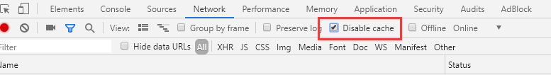

# 如何禁用浏览器缓存

在本视频中，我们将通过一个示例 讨论 ASP.NET Core 中的 Image Taghelper。

## 浏览器缓存

当我们访问网页时，大多数现代浏览器会缓存该网页的图像。当我们再次访问该页面时，浏览器不再从 Web 服务器再次下载相同的图像，而是从缓存中提供图像。在大多数情况下，这不是问题，因为图像不经常改变。但是这对于开发人员来说，相当的不友好。。。

## 禁用浏览器缓存

由于某种原因，如果您不希望浏览器使用它的缓存，您可以禁用它。例如，要在 Google Chrome 中禁用缓存

- 使用 F12 键，启动 Browser Developer Tools
- 单击“Network”选项卡
- 选中“Disable cache”复选框



> 禁用浏览器缓存的一个明显问题是，每次访问该页面时都必须从服务器下载图片。

## ASP.NET Core 中的 Image Taghelper

从性能角度来看，只有在服务器上更改了图片才能下载图片。如果图像未更改，请使用浏览器缓存中的图像。这意味着我们将拥有两全其美的优势。

Image Tag Helper 可以帮助我们实现这一效果。要使用 Image Taghelper，请包含 `asp-append-version`属性并将其设置为 true。

```html

```

Image TagHelper 增强了< img >标签，为静态图像文件提供**缓存破坏行为**。将图像的内容，生成唯一的散列值并将其附加到图片的 URL。此唯一字符串会提示浏览器从服务器重新加载图片，而不是从浏览器缓存重新加载。

```html

```

每次服务器上的图像更改时，都会计算并缓存新的哈希值。如果图像未更改，则不会重新计算哈希值。使用此唯一哈希值，浏览器会跟踪服务器上的图像内容是否已更改。

## 哈希缓存行为

Image Taghelper 使用`Sha512` 哈希计算利用 Web 服务器上的缓存支持来存储给定文件

Image Taghelper 使用 Web 服务器上的缓存服务来存储文件已计算的 `Sha512` 哈希值。 如果多次请求文件，则不重新计算哈希值。 只有当磁盘上的的文件发生更改时，将会重新计算生成新的哈希值，缓存才会失效。
