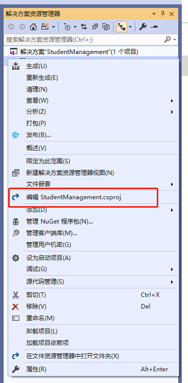
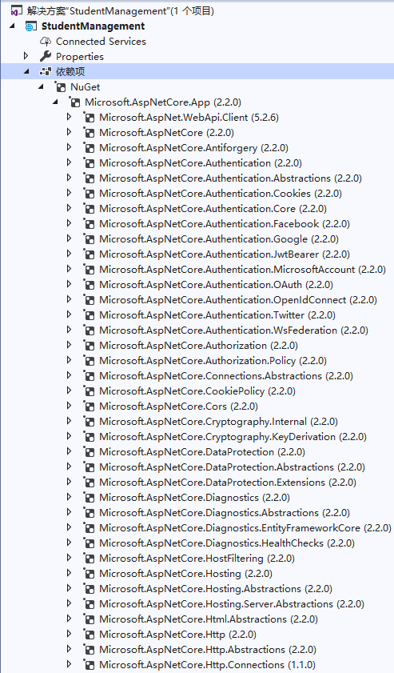

# 目录

> 本文出自[《从零开始学 ASP.NET CORE MVC》目录](https://www.52abp.com/wiki/mvc/0.1.4/1.Intro) </br>
> 视频课程效果更佳：[从零开始学 Asp.Net Core MVC](https://study.163.com/course/courseMain.htm?courseId=1209215803&share=2&shareId=400000000309007) </br>

# ASP.NET Core Web 项目文件

在本视频中，我们将探索并了解 asp.net core 项目文件。 我们使用 C＃作为编程语言，因此项目文件具有.csproj 扩展名。

如果您使用过以前版本的 ASP.NET，那么您可能对此文件非常熟悉，但此文件中包含的格式和内容在 asp.ne Core 中发生了很大变化。

一个重要的变化是，项目文件不包含任何文件夹或文件引用。

简单解释后的意思就是。在以前的 ASP.NET 中，当我们使用**解决方案资源管理器**向项目添加文件或文件夹时，**项目文件**中会包含对该文件或文件夹的引用。但是在 ASP.NET Core 中，**项目文件不包含任何文件夹或文件引用。**

**由文件系统来确定哪些文件和文件夹属于项目。**在项目的根目录中存在的所有文件和文件夹都是属于项目的一部分，将显示在**解决方案资源管理器**中。 当您在添加文件或文件夹时，该文件或文件夹将会变成项目的一部分，会立即显示在解决方案资源管理器中。 同样，当您在解决方案下的任何文件夹中删除文件或文件夹时，该已删除的文件或文件夹不再是项目的一部分，会立即从解决方案资源管理器中不再显示出来。

另外我们与**项目文件**的工作方式也发生了变化。在以前版本的 asp.net 中，为了能够编辑项目文件，我们首先要卸载项目，编辑并保存项目文件，然后重新加载项目。而在 asp.net core 中，我们可以编辑项目文件而无需卸载项目。

在解决方案中，右键单击项目名称并选择“编辑 StudentManagement.csproj” 文件。



这将在编辑器中打开.csproj 文件。

```csharp
<Project Sdk="Microsoft.NET.Sdk.Web">
  <PropertyGroup>
    <TargetFramework>netcoreapp2.2</TargetFramework>
    <AspNetCoreHostingModel>InProcess</AspNetCoreHostingModel>
  </PropertyGroup>
  <ItemGroup>
    <PackageReference Include="Microsoft.AspNetCore.App" />
    <PackageReference Include="Microsoft.AspNetCore.Razor.Design" Version="2.2.0" PrivateAssets="All" />
  </ItemGroup>
</Project>
```

**TargetFramework**：顾名思义，此元素是用于指定应用程序的目标框架，即您希望为应用程序提供的 APId 程序集。为了指定目标框架，我们使用了一个名为 Target Framework Moniker（TFM）的东西。正如您在上面的示例中所看到的，我们的应用程序针对 TargetFramework 的值为 netcoreapp2.2。netcoreapp2.2 是.NET Core 2.2 的 Moniker。当我们创建此应用程序时，我们从**新建项目中**下拉列表中选择了**.NET Core 2.2**作为目标框架。

**AspNetCoreHostingModel**：此元素指定应如何托管 Asp.Net Core 应用程序。它表示程序应该托管 InProcess（进程内）还是 OutOfProcess（进程外）。
InProcess 的值指定我们想要使用进程内托管模型，即在 IIS 工作进程（w3wp.exe）中托管我们的 asp.net core 应用程序。
OutOfProcess 的值指定我们要使用进程外托管模型，将 Web 请求转发到运行 Kestrel 服务器的后端 ASP.NET Core 应用程序。

> 我们将在即将发布的视频中详细讨论 InProcess（进程内）和 OutOfProcess（进程外）托管。

**PackageReference**：顾名思义，此元素用于包含对为您的应用程序安装的所有 NuGet 包的引用。在项目文件中，我们有以下 2 个 NuGet 包。

```
Microsoft.AspNetCore.App
Microsoft.AspNetCore.Razor.Design
```

**Microsoft.AspNetCore.App**：此 NuGet 包称为**metapackage**。
metapackage 本身是没有任何的内容的，它只是包含了其他包的依赖信息。
您可以在**解决方案资源管理器**中的 NuGet 下找到此元数据包，而 NuGet 又位于**依赖项(Dependencies)**下。展开元数据包时，您可以找到所有依赖项。




**Microsoft.AspNetCore.App**里面包含了**ASP.NET Core 2.2**及更高版本和**Entity Framework Core 2.2**及更高版本的所有组件。

在 ASP.NET Core 2.1 及更高版本的默认项目模板,都是会使用这个包。

请注意，metapackage 中没有版本号。 未指定版本时，SDK 会指定隐式版本。
.NET Core 团队建议依赖 SDK 指定的隐式版本，而不是在包引用上显式设置版本号。
如果目前还不完全清楚，请不要担心。

> 我们将在即将发布的视频中详细讨论**metapackage**和隐式版本。

Microsoft.AspNetCore.Razor.Design：此软件包包含对 Razor 的 MSBuild 支持，并由 Microsoft.AspNetCore.App 的 metapackage 包引用。

## 摘要

在本文中，我尝试解释了在 ASP.NET Core 中的项目文件的生成，以及里面常用的标签元素。
我希望这篇文章可以帮助您满足您的需求。
我想收到你的反馈意见。
请发布您对本文的反馈，问题或意见。

# 文章说明

> 如果您觉得我的文章质量还不错，欢迎打赏，也可以订阅我的视频哦 </br>
> 未得到授权不得擅自转载本文内容,52abp.com 保留版权 </br>
> 【收费】腾讯课堂:[https://ke.qq.com/course/392589?tuin=2522cdf3](https://ke.qq.com/course/392589?tuin=2522cdf3) </br>
> 【免费】youtube 视频专区：[http://t.cn/Ei0F2EB](http://t.cn/Ei0F2EB) </br>
> 感谢您对我的支持


## 关注微信公众号：角落的白板报


