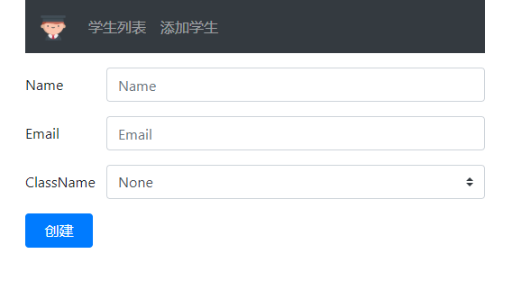
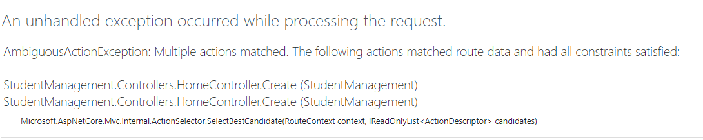
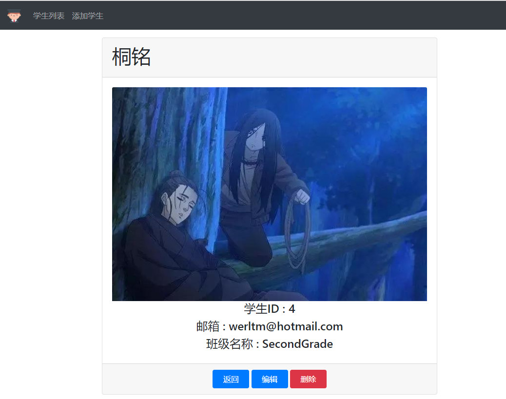

# ASP.NET Core 中的模型绑定

> 本文作者：梁桐铭- 微软最有价值专家（Microsoft MVP） </br>
> 文章会随着版本进行更新，关注我获取最新版本 </br>
> 本文出自[《从零开始学 ASP.NET Core 与 EntityFramework Core》目录](https://www.52abp.com/Wiki/mvc/latest) </br>
> 视频课程效果更佳：[跨平台开发实战掌握 ASP.NET Core 与 EntityFramework Core
> ](https://www.52abp.com/College/Course/1) </br>

在本节课中，我们将通过示例来学习 ASP.NET Core 中的模型绑定。

## 什么是模型绑定

- 模型绑定是将 HTTP 请求中的数据映射到控制器操作方法上对应的参数。
- 操作方法中的参数可以是简单类型，如整数，字符串等，也可以是复杂类型，如 Customer，Employee，Order 等。
- 模型绑定很棒，有了它我们节约大量的时间，因为没有它我们必须编写大量自定义代码来将请求数据映射到操作方法参数，这不仅无聊乏味而且容易出错。。

## ASP.NET Core 中的模型绑定简单例子

当 HTTP 请求到达我们的 MVC 应用程序时，它是处理传入请求的 `Controller` 操作方法。假设我们要查看 ID 为 2 的**学生详细信息**。为此，我们向以下 URL 发出 GET 请求

`http://localhost:3290/home/details/2`

我们的应用程序默认路由模板规则`（{controller = Home}/{action = Index}/{id?}）`路由将此请求发送到 `HomeController` 的 `Details（int? id）操作方法上。`

```csharp

  public IActionResult Details(int? id)
        {
            //实例化HomeDetailsViewModel并存储Student详细信息和PageTitle
            HomeDetailsViewModel homeDetailsViewModel = new HomeDetailsViewModel()
            {
                Student = _studentRepository.GetStudent(id??1),
                PageTitle = "学生详细信息"
            };
            return View(homeDetailsViewModel);
        }
```

参考以上代码：我们将请求 URL 中 id 值为 2 的参数映射到操作方法`Details(int? id)` 的中。这样 MVC 会将请求中的数据绑定到操作方法中对应的参数上。

**请注意**，在上面的示例中，默认路由模板中的参数名称为**id**，而 `Details(int? id)`操作方法中的参数名称也为 **id**。因此，Http 请求的（`http://localhost:3290/home/details/2`
）URL 中 id 值为 2 ,将被映射到操作方法为`Details(int? id)`中 Id 参数。

## 另外一个示例

`http://localhost:3290/home/details/2?name=pragim`

参考以下`Details()`操作方法处理上述请求 URL 并将 Id 值 2 映射到 id 参数，将值 pragim 映射到 name 参数中

```csharp
public string Details(int? id, string name)
{
    return "id = " + id.Value.ToString() + " 并且 名字 = " + name;
}

```

## HTTP 请求数据

要将请求数据绑定到**控制器操作方法上对应的参数**，模型绑定将按以下指定的顺序在以下位置查找来自 HTTP 请求中的数据。

- Form values (表单中值)
- Route values（路由中的值）
- Query strings（查询字符串）

## 模型绑定复杂类型的参数

模型绑定也适用于复杂类型，如**Customer**，**Student**，**Order**，**Employee**等。

参考以下“创建学生表单”信息：


当上述表单发布到服务器时，表单中的值将映射到`Create()`操作方法中**Student**对象中的对应的参数信息。参考下面的代码：

```csharp
public RedirectToActionResult Create(Student student)
{
    Student newStudent = _studentRepository.Add(student);
    return RedirectToAction("Details", new { id = newStudent.Id });
}

```

- ASP.Net Core 中的模型绑定器将来自 Post 请求中的表单值绑定到`Create()`操作方法中**Student**对象的属性。
- `input`标签中`name`属性为`Name`的值，将映射到`Student`对象中的`Name`属性。
- 类似的，`input`标签中`name`属性为`Email`的值,也同样会被映射到`Student`对象中的`Email`属性
- 班级 `ClassName` 也是同样的原理。

## 在 IStudentRepository 接口中添加 Add() 方法

参考一下代码

```csharp

 public  interface IStudentRepository
    {

        Student GetStudent(int id);


        IEnumerable<Student> GetAllStudents();

        Student Add(Student student);

    }
```

## MockStudentRepository 类中实现 Add() 方法

我们需要在`MockStudentRepository`中实现 Add()方法，填写上业务逻辑，参考一下代码：

```csharp
using System;
using System.Collections.Generic;
using System.Linq;
using System.Threading.Tasks;

namespace StudentManagement.Models
{
    public class MockStudentRepository : IStudentRepository
    {
        private List<Student> _studentList;


        public MockStudentRepository()
        {

            _studentList = new List<Student>()
            {
            new Student() { Id = 1, Name = "张三", ClassName = ClassNameEnum.FirstGrade, Email = "Tony-zhang@52abp.com" },
            new Student() { Id = 2, Name = "李四", ClassName = ClassNameEnum.SecondGrade, Email = "lisi@52abp.com" },
            new Student() { Id = 3, Name = "王二麻子", ClassName = ClassNameEnum.GradeThree, Email = "wang@52abp.com" },
            };


        }

        public Student Add(Student student)
        {
            student.Id = _studentList.Max(s => s.Id) + 1;
            _studentList.Add(student);
            return student;
        }

        public IEnumerable<Student> GetAllStudents()
        {
            return _studentList;

        }

        public Student GetStudent(int id)
        {
            return    _studentList.FirstOrDefault(a => a.Id == id);
        }
    }
}

```

## HttpGet 与 HttpPost

目前在`HomeController`中我们有以下 2 个`Create()`操作方法。

```csharp
 public ViewResult Create()
        {
            return View();
        }

        public RedirectToActionResult Create(Student student)
        {
            Student newStudent = _studentRepository.Add(student);
            return RedirectToAction("Details", new { id = newStudent.Id });
        }

```

如果我们通过 url 访问`http://localhost:3290/home/Create`那么我们会受到如下错误
:
**AmbiguousActionException: Multiple actions matched. The following actions matched route data and had all constraints satisfied:**
或者参考下图


这是因为 asp.net core 不知道要执行哪个操作方法。我们希望第一个 Create()操作方法响应 GET 请求，第二个 Create()操作方法响应 POST 请求。
那么我们需要告诉 asp.net core 使用 HttpGet 和 HttpPost 属性修饰 Create()操作方法，如下所示。

```csharp
[HttpGet]
public ViewResult Create()
{
    return View();
}

[HttpPost]
public RedirectToActionResult Create(Student student)
{
 Student newStudent = _studentRepository.Add(student);
return RedirectToAction("Details", new { id = newStudent.Id });
}
```

响应 POST 请求的`Create()`操作方法将新学生信息添加到`StudentRepository`中，并将用户重定向到 `Details()`操作方法中，向其传递新创建的学生的 ID。

如果在重定向时，如果返回的是 `NullReferenceException`异常信息，请确保使用 `AddSingleton()`方法而不是`AddTransient()`方法。
你可以在 `Startup.cs` 文件的 `ConfigureServices()`方法中注册 `IStudentRepository` 服务。

```csharp
 public void ConfigureServices(IServiceCollection services)
        {
            services.AddMvc();
            services.AddSingleton<IStudentRepository, MockStudentRepository>();
//其他代码
        }
```

我们将在即将发布的内容中讨论导致此错误的原因以及 依赖注入组件中的`AddSingleton()`，`AddTransient()`和 `AddScoped()`方法之间的区别。

## 运行后的结果


以上就是我们随意输入一个信息后，得到的结果。

目前，创建学生表单没有任何验证。如果我们在不填写任何表单字段的情况下提交表单，我们将创建一个名字和电子邮件字段都为空的新员工，这是不合理的。

我们将在下一个内容中讨论**表单验证**。

#### 文章说明

> 如果您觉得我的文章质量还不错，欢迎打赏，也可以订阅我的视频哦 </br>
> 未得到授权不得擅自转载本文内容,52abp.com 保留版权 </br>
> 感谢您对我的支持

## 关注微信公众号：角落的白板报


