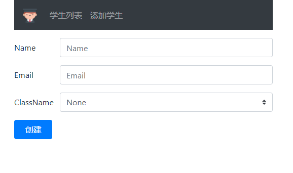

# ASP.NET Core 中的模型验证

> 本文作者：梁桐铭- 微软最有价值专家（Microsoft MVP） </br>
> 文章会随着版本进行更新，关注我获取最新版本 </br>
> 本文出自[《从零开始学 ASP.NET Core 与 EntityFramework Core》目录](https://www.52abp.com/Wiki/mvc/latest) </br>
> 视频课程效果更佳：[跨平台开发实战掌握 ASP.NET Core 与 EntityFramework Core
> ](https://www.52abp.com/College/Course/1) </br>

在本章节中，我们将通过示例来学习 Asp.net core 中的模型验证。

## 模型验证示例

请看下图，我们在创建学生信息的表单中，需要同时创建**名字**和**邮箱**两个字段。



必填的字段，如果未提供所需要的值，并且提交了表单，我们希望可以显示验证错误信息给用户，如下图所示：


如果提供的是无效的邮箱信息，我们希望显示**无效的邮箱格式**错误信息给用户，如下图所示：


要使`Name`字段成为必填字段，请在`Student`模型类的`Name`属性上添加`Required`属性。必需属性位于`System.ComponentModel.DataAnnotations`命名空间中，所以我们需要补充对应的命名空间,参考以下代码。

```csharp
    /// <summary>
    /// 学生模型
    /// </summary>
    public class Student
    {
        public int Id { get; set; }
        [Required]
        public string  Name { get; set; }
        public ClassNameEnum ClassName { get; set; }

        public string Email { get; set; }


    }
```

## ModelState.IsValid 属性验证

- 提交表单时，将执行以下`Create()`操作方法
- 在创建学生表单视图中表单模型是 Student 类
- 提交表单时，模型绑定将 Post 请求的表单值映射到 Student 类的相应属性
- 在**Name**属性上添加了**Required**属性，它会判断 Name 中的值，如果该 Name 中的值为空，或者属性不存在，则会验证失败
- 使用`ModelState.IsValid` 属性会检查验证是否失败或成功
- 如果验证失败，我们返回相同的视图，以便用户可以提供所需的数据并重新提交表单。

我们修改我们的`Create()`代码后：

```csharp
        [HttpPost]
        public IActionResult Create(Student student)
        {
            if (ModelState.IsValid)
            {

                Student newStudent = _studentRepository.Add(student);
     return RedirectToAction("Details", new { id = newStudent.Id });
            }
            return View();
        }

```

## 在视图中显示模型验证错误

要显示验证错误，请使用 `asp-validation-for` 和 `asp-validation-summary` TagHelper。`asp-validation-for` TagHelper 用于显示模型类的单个属性的验证消息。`asp-validation-summary` TagHelper 用于显示验证错误的摘要信息。

要显示与 `Student` 类的 `Name` 属性关联的验证错误，请在`<span>` 元素上使用 `asp-validation-for`TagHelper，如下所示。

```html
<div class="form-group row">
  <label asp-for="Name" class="col-sm-2 col-form-label"></label>
  <div class="col-sm-10">
    <input asp-for="Name" class="form-control" placeholder="请输入名字" />
    <span asp-validation-for="Name"></span>
  </div>
</div>
```

要显示所有验证错误的摘要，请在`<div>`元素上使用 `asp-validation-summary` ，如下所示。

```html
<div asp-validation-summary="All"></div>
```

以上代码，我们可以添加在视图中`<form>`属性下面。

`asp-validation-summary` taghelper 可以用于以下情况的验证：

- All
- ModelOnly
- None

我们现在先讲值设置为`All`，而对于他们三者之间的区别，我们在后面的章节中讨论他们。

## 自定义模型验证错误消息

默认情况下，`Name` 属性上的 `Required` 属性显示以下验证错误消息。
名字的字段是必需的。

如果要将验证错误消息更改为“**请输入名字**”，可以使用 `Required` 属性的 `ErrorMessage` 属性执行此操作，如下所示:

```csharp
    public class Student
    {
        public int Id { get; set; }
        [Required(ErrorMessage = "请输入名字")]
        public string  Name { get; set; }
        public ClassNameEnum ClassName { get; set; }
        public string Email { get; set; }
    }

```

## ASP.NET Core 内置模型验证属性

以下是 ASP.NET Core 中内置的一些验证属性

<table class="table" >
<thead>
<tr class="text text-danger">
<th>属性</th>
<th>作用</th>          
</tr>
</thead>
<tbody>
</tbody>
<tr>
<td>Required</td>
<td>指定该字段是必填的的</td>
</tr><tr>
<td>Range</td>
<td>指定允许的最小值和最大值</td>
</tr>

<tr>
<td>MinLength</td>
<td>使用 MinLength 指定字符串的最小长度</td>
</tr>
<tr>
<td>MaxLength</td>
<td>使用 MinLength  指定字符串的最大长度
</td>
</tr>
<tr>
<td>Compare</td>
<td>比较模型的 2 个属性。例如，比较 Email 和 ConfirmEmail 属性</td>
</tr>
<tr>
<td>RegularExpression</td>
<td>正则表达式 验证提供的值是否与正则表达式指定的模式匹配
</td>
</tr>
</table>

## 显示属性

这不是验证属性。它的作用一般是用于增强视图中的显示作用。

例如，在 视图 中默认情况下，`Email`字段的标签显示文本`Email`，因为属性名称为`Email`。

```csharp
  public class Student
    {
        public int Id { get; set; }
        [Required]
        public string  Name { get; set; }

        public ClassNameEnum ClassName { get; set; }


        public string Email { get; set; }
    }

```

如果您希望在视图中的标签显示 `电子邮件`，请使用`Display`属性

```csharp
  public class Student
    {
        public int Id { get; set; }
        [Required]
        public string  Name { get; set; }

        public ClassNameEnum ClassName { get; set; }

        [Display(Name = "电子邮件")]
        public string Email { get; set; }
    }

```

## 使用多个模型验证属性

可以在属性上应用多个验证属性，只需要使用逗号将他们分隔开，如 `Name` 属性所示，当然你也可以将它们堆叠在一起，如 `Email` 属性所示。

```csharp
    public class Student
    {
        public int Id { get; set; }
        [Required, MaxLength(50, ErrorMessage = "名字的长度不能超过50个字符")]
        public string  Name { get; set; }

        public ClassNameEnum ClassName { get; set; }

        [Display(Name = "电子邮件")]
        [RegularExpression(@"^[a-zA-Z0-9_.+-]+@[a-zA-Z0-9-]+\.[a-zA-Z0-9-.]+$",
        ErrorMessage = "邮箱的格式不正确")]
        [Required]
        public string Email { get; set; }
    }
```

## 自定义模型验证错误的颜色

如果我们要更改视图中模型验证错误的文字的颜色，请在具有`asp-validation-for` 和 `asp-validation-summary` Taghelper 的`<span>`>和 `< div >` 元素上使用 **Bootstrap **中`text-danger` 类

```html
<div asp-validation-summary="All" class="text-danger"></div>
<span asp-validation-for="Name" class="text-danger"></span>
```

## 小结

最后我们通过 Display 属性将所有的 Name 属性修改为中文。

### 文章说明

> 如果您觉得我的文章质量还不错，欢迎打赏，也可以订阅我的视频哦 </br>
> 未得到授权不得擅自转载本文内容,52abp.com 保留版权 </br>
> 感谢您对我的支持

## 关注微信公众号：角落的白板报


