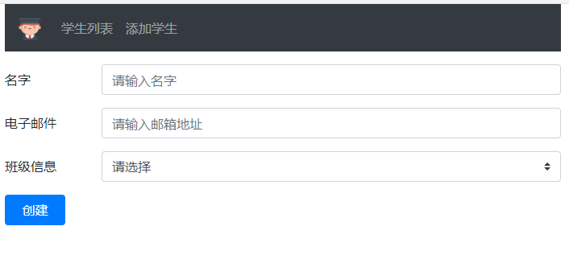
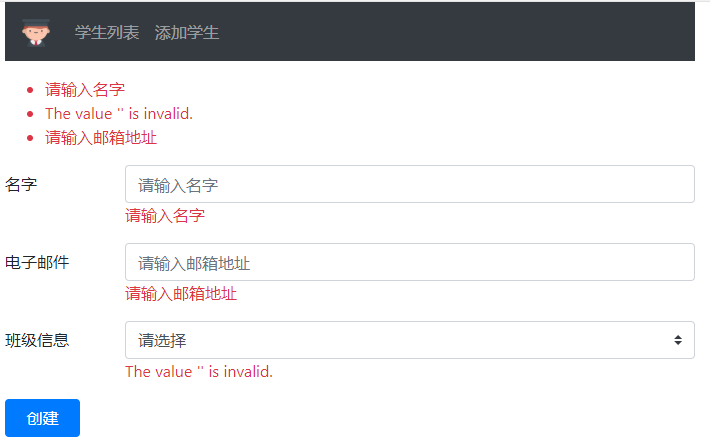
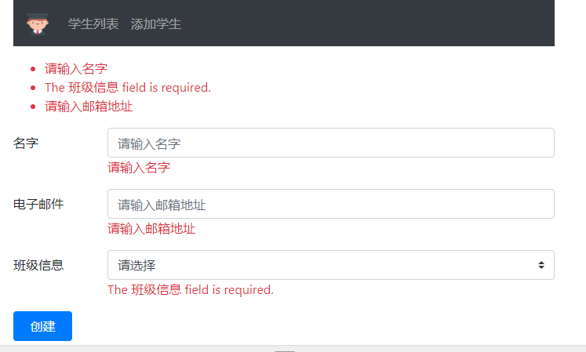

# 在 ASP.NET Core 中`<select>`标签的验证

> 本文作者：梁桐铭- 微软最有价值专家（Microsoft MVP） </br>
> 文章会随着版本进行更新，关注我获取最新版本 </br>
> 本文出自[《从零开始学 ASP.NET Core 与 EntityFramework Core》目录](https://www.52abp.com/Wiki/mvc/latest) </br>
> 视频课程效果更佳：[跨平台开发实战掌握 ASP.NET Core 与 EntityFramework Core
> ](https://www.52abp.com/College/Course/1) </br>

在本章节中，我们将讨论在`ASP.NET Core`中的`<select>标签`上实现所需的验证。

## 查看`<select>`标签示例

让我们通过一个例子来理解这一点。

请参考下图，我们需要将他们的**班级**字段修改为必填选项。在这些选项中，我们希望将**请选择**作为第一个选项。



它不是一个有效的选项，它的作用只是为了提示用户选择一个有效的`班级信息`。
在选择列表中有效的选择项是从`ClassNameEnum`枚举中获取来的。

```csharp
 public enum ClassNameEnum
    {
        [Display(Name ="未分配")]
        None,
        [Display(Name = "一年级")]
        FirstGrade,
        [Display(Name = "二年级")]
        SecondGrade,
        [Display(Name = "三年级")]
        GradeThree
    }

```

## Html 页面中的班级选择列表

注意，我们使用的是`asp-items`TagHelper 将**班级信息**列表绑定到`ClassNameEnum` 枚举。

```html
<div class="form-group row">
  <label asp-for="ClassName" class="col-sm-2 col-form-label"></label>
  <div class="col-sm-10">
    <select
      asp-for="ClassName"
      class="custom-select mr-sm-2"
      asp-items="Html.GetEnumSelectList<ClassNameEnum>()"
    >
    </select>
  </div>
</div>
```

## 给选择列表增加第一个选择项

我们希望选择列表中的第
一个选项是**请选择**。实现此目的的最简单方法是在选择列表 HTML 中包含`<option>`标签，如下所示。

```html
<div class="form-group row">
  <label asp-for="ClassName" class="col-sm-2 col-form-label"></label>
  <div class="col-sm-10">
    <select
      asp-for="ClassName"
      class="custom-select mr-sm-2"
      asp-items="Html.GetEnumSelectList<ClassNameEnum>()"
    >
      <option value=""> 请选择</option>
    </select>
    <span asp-validation-for="ClassName" class="text-danger"></span>
  </div>
</div>
```

**请选择**选项的`value`属性设置为空字符串。我们还使用 `asp-validation-for` tag helper 来显示验证错误,并且将错误信息的颜色设置为红色。

## 使选择列表成为必填

```csharp
public class Student
    {
        public int Id { get; set; }
        [Required(ErrorMessage ="请输入名字"), MaxLength(50, ErrorMessage = "名字的长度不能超过50个字符")]
        [Display(Name = "名字")]
        public string  Name { get; set; }
        [Required]
        [Display(Name = "班级信息")]
        public ClassNameEnum ClassName { get; set; }

        [Display(Name = "电子邮件")]
        [RegularExpression(@"^[a-zA-Z0-9_.+-]+@[a-zA-Z0-9-]+\.[a-zA-Z0-9-.]+$",
        ErrorMessage = "邮箱的格式不正确")]
        [Required(ErrorMessage = "请输入邮箱地址")]
        public string Email { get; set; }
    }

```

如果我们现在运行项目并提交表单，而没有从选择列表中选择有效的**班级信息**，则会 收到错误 。

- The value '' is invalid.
  翻译为中文：- 值''无效。

  

但是我们在这里得到的错误不是`Required`验证失败的验证错误。为了证明这一点，从`Student`类的`ClassNameEnum`属性中删除`[Required]`属性，您仍然会得到相同的错误。

让我们首先理解为什么我们会收到此错误 -The value '' is invalid.

- ClassName 属性的数据类型是 ClassNameEnum 枚举信息。
- 默认情况下，枚举基础数据类型为 int。
- 将空字符串设置为 HTML 中选择列表的**请选择** 选项的值。
- 因此，当从选择列表中选择此选项 **请选择**时，ClassName 的数据类型为`int`，而空字符串的数据类型为`string`。
- 显然，空字符串不是 int 的有效值。
- 这就是我们得到返回值- The value '' is invalid.的原因 。
- 值类型（例如 int，float，decimal，DateTime）本身就是必需的，不需要添加 Required 属性。

## 让选择列表成为真正的必需验证

所以，如果通过包含问号而使 ClassName 属性成为可为空的属性，就需要添加`[Required]`属性才能使该字段成为必填字段。

```csharp
 public class Student
    {
        public int Id { get; set; }
        [Required(ErrorMessage ="请输入名字"), MaxLength(50, ErrorMessage = "名字的长度不能超过50个字符")]
        [Display(Name = "名字")]
        public string  Name { get; set; }
        [Required]
        [Display(Name = "班级信息")]
        public ClassNameEnum? ClassName { get; set; }

        [Display(Name = "电子邮件")]
        [RegularExpression(@"^[a-zA-Z0-9_.+-]+@[a-zA-Z0-9-]+\.[a-zA-Z0-9-.]+$",
        ErrorMessage = "邮箱的格式不正确")]
        [Required(ErrorMessage = "请输入邮箱地址")]
        public string Email { get; set; }
    }


```

如果我们现在选择“**请选择**”作为表单的选择项，我们会获得必填的验证错误，如下图：



## 文章说明

> 如果您觉得我的文章质量还不错，欢迎打赏，也可以订阅我的视频哦 </br>
> 未得到授权不得擅自转载本文内容,52abp.com 保留版权 </br>
> 感谢您对我的支持

## 关注微信公众号：角落的白板报


