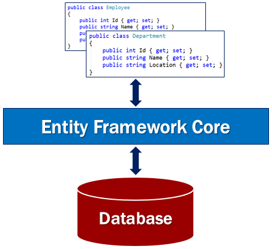

# 什么是 EF Core,什么是 ORM,为什么要使用 ORM 三联回答

> 本文作者：梁桐铭- 微软最有价值专家（Microsoft MVP）  
> 文章会随着版本进行更新，关注我获取最新版本  
> 本文出自[《从零开始学 ASP.NET Core 与 EntityFramework Core》目录](https://www.52abp.com/Wiki/mvc/latest)  
> 视频课程效果更佳：[跨平台开发实战掌握 ASP.NET Core 与 EntityFramework Core
> ](https://www.52abp.com/College/Course/1)  

本章是对 Entity Framework Core 的介绍。Entity Framework Core，也称为 EF Core，它是一个完全重写的 ORM。如果您有使用过旧版本的 Entity Framework 的任何经验，您会发现许多熟悉的功能。

## 什么是 EF Core

EF Core 是 ORM（对象关系映射器）。

EF Core 是轻量级，可扩展和开源的软件。与.NET Core 一样，EF Core 也是跨平台的。它适用于 Windows，Mac OS 和 Linux。EF Core 是微软的官方数据访问平台。

## 什么是 ORM

ORM 的全称是 Object-Relational Mapper,翻译为中文是**对象关系映射**，它使开发人员能够使用业务对象去处理数据库。作为开发人员，我们使用应用程序业务对象，ORM 生成底层数据库可以理解的 SQL。简而言之，ORM 降低了开发人员编写的代码量，如果不使用 ORM 通常需要很多访问数据库的代码或者 SQL。

## 为什么要使用 ORM

为了方便我们理解，使用一个例子来解释 ORM。如果我们正在开发一个学生管理系统，我们会有像 `Student ，Department、Course` 这样的类在我们的应用程序代码中。这些类称为 **领域模型**或者说是**实体类**，**模型类**，可见中国语言博大精深。。 。

如果没有像 EF Core 这样的 ORM，我们必须编写大量的代码来访问数据库,来存储和检索底层数据库中的学生和部门数据。

例如，要**查询**，**添加**，**更新**或**删除**底层数据库表中的数据，我们必须在应用程序中编写代码，以生成底层数据库可以理解的 sql 语句。此外，当数据从数据库被我们读取，需要显示到我们的应用程序时，我们再次编写自定义代码以将数据库数据映射到我们的模型类，如 `Student ，Department、Course` 等。这是我们几乎在每个应用程序中都需要做的非常常见的任务。

而有了像 EF Core 这样的 ORM 可以为我们完成这些所有的琐事,为我们节省了大量时间。它就是帮助我们在应用程序代码和数据库之间的粘合剂。它消除了我们通常在没有 ORM 的情况下需要编写大量的代码来访问数据库的需要。

## EF Core Code First 模式

EF Core 支持 Code First 方法和 Database First 方法(也被称作 DB First)。但是，如果你是使用 Database First 方法，目前 EF Core 对他的支持非常有限。

使用 `Code First` 方法，我们需要首先创建我们应用程序所需要的`领域类`，如 Student ClassName、Order 等，以及从 Entity Framework DbContext 派生的特殊类
。基于这些`领域类`和 DBContext 类，EF Core 会为我们创建数据库和相关表。开箱即用，EF Core 使用它的默认约定来创建数据库和数据库表。而且如果有需要，我们还可以更改这些默认约定。

## EF Core Database First 模式

有时我们可能有一个现有数据库。当我们已经有数据库和数据库表时，我们使用 DB First 的方式来进行开发。使用 DB First ，EF Core 基于现有数据库的模型来创建 DBContext 和 `领域类` 。

## EF Core 所支持的数据库

EF Core 支持许多**关系数据库**甚至**非关系数据库**。EF Core 可以通过使用称为数据库提供程序的插件库来实现此目的。这些数据库提供程序以 NuGet 包的形式提供。

EF Core 目前支持的数据库以及这些数据库提供程序的插件列表:

[https://docs.microsoft.com/zh-cn/ef/core/providers/
](https://docs.microsoft.com/zh-cn/ef/core/providers/)

数据库提供程序，通常位于 EF Core 及其支持的数据库之间。数据库提供程序包含特定于其支持的数据库的功能。所有数据库通用的功能都在 EF Core 组件中。而对于一些特定于数据库的功能，例如，Microsoft SQL Server 特定功能需要与 EF Core 的 SQL Server 提供程序一起使用。

当我们在即将发布的内容中的 asp.net Core 应用程序中包含对 SQL Server 的支持时，我们将讨论有关此提供程序模型的更多信息。

## 文章说明

> 如果您觉得我的文章质量还不错，欢迎打赏，也可以订阅我的视频哦  
> 未得到授权不得擅自转载本文内容,52abp.com 保留版权  
> 感谢您对我的支持

## 关注微信公众号：角落的白板报

