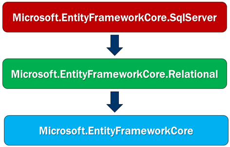
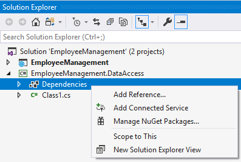

# 单层 Web 应用和多层 Web 应用的区别

> 本文作者：梁桐铭- 微软最有价值专家（Microsoft MVP） </br>
> 文章会随着版本进行更新，关注我获取最新版本 </br>
> 本文出自[《从零开始学 ASP.NET Core 与 EntityFramework Core》目录](https://www.52abp.com/Wiki/mvc/latest) </br>
> 视频课程效果更佳：[跨平台开发实战掌握 ASP.NET Core 与 EntityFramework Core
> ](https://www.52abp.com/College/Course/1) </br>

在本章节中，我们将讨论如何在 Visual Studio 中安装 Entity Framework Core。

根据您的项目设置方式，您可能已经安装了 Entity Framework Core。

## 单层 Web 应用程序

如果它是一个小项目，您可以在一个项目中拥有**界面层**，**业务逻辑层**和**数据访问层**。因此，如果您使用 ASP.NET Core 2.1 或更高版本创建了一个 Web 应用程序项目，那么在该 Web 应用程序项目中，您已经安装了 Entity Framework Core。

## ASP.NET Core Web 应用程序项目中 Entity Framework Core

使用 ASP.NET Core 2.1 或更高版本创建的 ASP.NET Core Web 应用程序项目安装了以下 NuGet 包。

```
Microsoft.AspNetCore.App
```

这个包称为 **metapackage** ,目前还没有标准的中文翻译，我个人喜欢叫它**综合功能包**。**综合功能包**没有自己的内容，但是有依赖项列表（其他包）。您可以在解决方案资源管理器中找到此**综合功能包**。展开**综合功能包**时，您可以找到所有依赖项。在依赖项中，您将找到已安装的 Entity Framework Core nuget 软件包。

所以我想说的是，使用 ASP.NET Core Version 2.1 或更高版本创建的 asp.net core Web 应用程序项目中已经安装了 Entity Framework Core ，它是作为 **综合功能包**的一部分。

## 多层 Web 应用程序--三层架构

在中小型应用程序中，我们通常至少有以下 3 层,也被称作**多层 SOA 架构**，**三层架构** :

- 界面层
- 业务逻辑层
- 数据访问层

这些层的实现都为单独的项目。Entity Framework Core 通常在数据访问层项目中,因为它是必需的。数据访问层项目是一个类库项目，通常不会引用**综合功能包**。所以这意味着，没有为数据访问层项目安装 Entity Framework Core。

## 多层 Web 应用程序-- 领域驱动设计架构

在大型应用程序中,有很多的架构体系，众多开发极客们，也视图找到一种银弹，而目前我个人所推崇的设计思想是：**领域驱动设计**简称：DDD。而在这种思想下进行代码库分层可以
降低代码复杂性并提高代码的可重用性。目前我着力于推广的开发框架 52ABP 也是基于领域驱动设计思想而来。

**领域驱动设计（DDD）中有四个基本层：**

- 展现层(Presentation)：向用户提供一个接口(UI)，使用应用层来和用户(UI)进行交互。

- 应用层(Application)：应用层是展现层和领域层能够实现交互的中间者，协调业务对象去执行特定的应用任务。

- 领域层(Domain)：包括业务对象和业务规则，这是应用程序的核心层。

- 基础设施层(Infrastructure)：提供通用技术来支持更高的层。例如基础设施层的仓储(Repository)可通过 ORM 来实现数据库交互，或者提供发送邮件的支持。

同样的基础设施层也会是一个类库项目，通常不会引用**综合功能包**。所以这意味着，没有为数据访问层项目安装 Entity Framework Core。

## 安装 Entity Framework Core

要安装 Entity Framework Core 并能够将 SQL Server 用作应用程序的数据库，需要安装以下 nuget 包。

<table class="table" >
<thead>
<tr class="text text-danger">
<th>nuget 包</th>
<th>作用</th>          
</tr>
</thead>
<tbody>
</tbody>
<tr>
<td>Microsoft.EntityFrameworkCore.SqlServer</td>
<td>此nuget包包含SQL Server特定的功能
</td>
</tr><tr>
<td>Microsoft.EntityFrameworkCore.Relational	</td>
<td>此nuget包包含所有关系数据库通用的功能
</td>
</tr>

<tr>
<td>Microsoft.EntityFrameworkCore	</td>
<td>此nuget包包含通用实体frameowrk核心功能
</td>
</tr> 
</table>


- Microsoft.EntityFrameworkCore.SqlServer 依赖于 Microsoft.EntityFrameworkCore.Relational 包。
- Microsoft.EntityFrameworkCore.Relational 包依赖于
- Microsoft.EntityFrameworkCore 包依赖于其他几个包。

当我们安装 `Microsoft.EntityFrameworkCore.SqlServer` 包时，它还会自动安装所有其他相关的 `nuget` 包。

## 在类库项目中，安装 nuget 包

右键单击“Solution Explorer”中的“Dependencies”节点，然后从上下文菜单中选择“Manage NuGet Packages”。


在弹出的屏幕上，搜索要安装的软件包，然后按照屏幕上的说明进行操作。

我们使用 SQL Server 作为我们应用程序的数据库，因此我们使用了 nuget 包 `Microsoft.EntityFrameworkCore.SqlServer`。此包通常称为**数据库提供程序包**。

如果要在应用程序中使用其他数据库，则必须安装该数据库提供程序特定的 nuget 包而不是 Microsoft.EntityFrameworkCore.SqlServer 数据库提供程序包。

例如，如果要使用 mysql 作为数据库，则安装 **Pomelo.EntityFrameworkCore.MySql** 数据库提供程序包。同样，如果要将 PostgreSQL 用作数据库，请使用 **Npgsql.EntityFrameworkCore.PostgreSQL** 数据库提供程序包。

您可以在以下 MSDN 页面上找到所有提供程序特定的 NuGet 包
[https://docs.microsoft.com/zh-cn/ef/core/providers/
](https://docs.microsoft.com/zh-cn/ef/core/providers/)

## 文章说明

> 如果您觉得我的文章质量还不错，欢迎打赏，也可以订阅我的视频哦 </br>
> 未得到授权不得擅自转载本文内容,52abp.com 保留版权 </br>
> 感谢您对我的支持

## 关注微信公众号：角落的白板报


