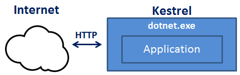
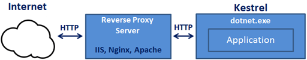

# 目录

> 本文出自[《从零开始学 ASP.NET CORE MVC》目录](https://www.52abp.com/wiki/mvc/0.1.4/1.Intro) </br>
> 视频课程效果更佳：[从零开始学 Asp.Net Core MVC](https://study.163.com/course/courseMain.htm?courseId=1209215803&share=2&shareId=400000000309007) </br>

# ASP.NET Core 进程外(out-of-process)托管

在本视频中，我们将讨论 ASP.NET Core 中的`Out Of Process Hosting`。这是第 6 节的延续。

## ASP.NET Core 进程内(InProcess)托管

我们先简单回顾下 ASP.NET Core 中,要配置 InProcess 的服务器，

需要在项目文件中添加``< AspNetCoreHostingModel >`元素，其值为`InProcess`

```xml
< AspNetCoreHostingModel > InProcess </ AspNetCoreHostingModel >
```

使用 InProcess 托管，应用程序托管在 IIS 工作进程（w3wp.exe 或 iisexpress.exe）中。
使用 InProcess 托管，只有一个 Web 服务器，它是承载我们的应用程序的 IIS 服务器。


# ASP.NET Core 进程外(out-of-process)托管

有两种方法可以配置进程外托管 :

- 方法一：将`< AspNetCoreHostingModel >`元素添加到应用程序的项目文件中，其值为`OutOfProcess`

```xml
< AspNetCoreHostingModel > OutOfProcess </ AspNetCoreHostingModel >
```

- 方法二：默认为`OutOfProcess`托管。因此，如果我们 从项目文件中删除 `< AspNetCoreHostingModel >`元素，默认情况下 ASP.NET Core 将使用`OutOfProcess`托管。

## 进程外(out-of-Process)托管

- 有 2 个 Web 服务器 ,内部 Web 服务器和外部 Web 服务器。
- 内部 Web 服务器是 Kestrel， 外部 Web 服务器可以是 IIS，Nginx 或 Apache。在上节课中我们讨论了什么是 Kestrel

根据您运行 asp.net Core 应用程序的方式的不同，可能会,也可能不会使用外部 Web 服务器。

#

Kestrel 是嵌入在 asp. net Core 应用程序中的跨平台 web 服务器。使用`进程外(out-of-Process)托管`, Kestrel 可通过以下两种方式来进行使用：

**Kestrel 可以用作面向互联网的 web 服务器, 直接处理传入的 HTTP 请求。**
在此模型中, 我们不使用外部 web 服务器。只使用 Kestrel, 它作为服务器可以自主面向互联网, 直接处理传入的 HTTP 请求。
当我们使用. net Core CLI 运行 asp. net Core 应用程序时, Kestrel 是唯一用于处理和处理传入 HTTP 请求的 web 服务器。




**Kestrel 还可以与反向代理服务器 (如 IIS、Nginx 或 Apache) 结合使用。**





## 来个讨论

> 如果 Kestrel 可以单独用作 Web 服务器，为什么我们需要一个反向代理服务器？

因为 Kestrel 使用 "进程外(out-of-process)托管", 结合反向代理服务器是一个不错的选择, 因为它提供了额外的配置和安全性层。它可能会更好地与现有基础设施集成。它还可用于负载平衡。

因此, 在使用反向代理服务器的情况下, 它将接收来自网络的传入 HTTP 请求, 并将其转发到 Kestrel 服务器进行处理。在处理请求时, Kestrel 服务器将响应发送到反向代理服务器, 然后反向代理服务器最终通过网络将响应发送到请求的客户端。

在后面的视频课程中，我们将学习如何将 ASP.NET Core 应用程序部署到 IIS 并使用 IIS 作为反向代理服务器。当我们直接从 Visual Studio 运行 asp.net Core 应用程序时，它默认使用 IIS Express。
由于我们已将应用程序配置为使用`进程外托管`，所以当前情况下，IIS Express 已经在充当反向代理服务器了。

`IIS Express`接收传入的 HTTP 请求并将其转发给`Kestrel`进行处理。`Kestrel`处理请求并将响应发送到`IIS Express`。IIS Express 反过来将该响应发送到浏览器。

使用`进程外托管`无论您是否使用反向代理服务器，Kestrel 服务器都是作为托管应用程序的服务器同时处理请求的，也就是我们最开始说的自托管。
如果使用反向代理服务器接收传入的 HTTP 请求并将其转发到 Kestrel 服务器。同样，它从 Kestrel 服务器获取响应并将其发送到客户端。因此托管应用程序的进程名称是`dotnet.exe`。

# 使用以下代码获取进程名称

我们来操作一波，给大家演示看看。记住下面这行代码，是个知识点

```csharp
System.Diagnostics.Process.GetCurrentProcess().ProcessName;
```

当我们使用.NET Core CLI 运行 asp.net Core 项目时，默认情况下它会忽略我们在.csproj 文件中指定的`托管设置`。因此项目文件中的``AspNetCoreHostingModel`标签下的值是被忽略了的。
无论您指定的值（InProcess 或 OutOfProcess）如何，它始终都是 OutOfProcess 托管，都是通过 Kestrel 托管应用程序,同时处理 http 请求。

# 一个常见问题

> 我们可以在不使用内置的 Kestrel Web 服务器的情况下运行 asp.net Core 应用程序吗？

答案是肯定可以的，你要相信.NET Core 的开发团队。如果我们使用 InProcess 托管，则应用程序将托管在 IIS 工作进程（w3wp.exe 或 iisexpress.exe）中。
知识点：`Kestrel不与InProcess(进程内）托管一起使用`。

所以.net core 有多优秀大家知道了吧。欢迎留言互动~
代理服务器: 泛指 IIS，Nginx 或 Apache 等等

# 文章说明

> 如果您觉得我的文章质量还不错，欢迎打赏，也可以订阅我的视频哦 </br>
> 未得到授权不得擅自转载本文内容,52abp.com 保留版权 </br>
> 【收费】腾讯课堂:[https://ke.qq.com/course/392589?tuin=2522cdf3](https://ke.qq.com/course/392589?tuin=2522cdf3) </br>
> 【免费】youtube 视频专区：[http://t.cn/Ei0F2EB](http://t.cn/Ei0F2EB) </br>
> 感谢您对我的支持

 

## 关注微信公众号：角落的白板报

 
 


