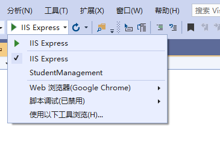

# 目录

> 本文出自[《从零开始学 ASP.NET CORE MVC》目录](https://www.52abp.com/wiki/mvc/0.1.4/1.Intro) </br>
> 视频课程效果更佳：[从零开始学 Asp.Net Core MVC](https://study.163.com/course/courseMain.htm?courseId=1209215803&share=2&shareId=400000000309007) </br>

# ASP.NET Core launchsettings.json 文件

在本视频中，我们将讨论在 ASP.NET Core 项目中`launchsettings.json`文件的重要性。

# launchsettings.json 文件

- 您将在项目根文件夹的**“Properties”**文件夹中找到此文件。
- 当我们从 Visual Studio 或使用.NET Core CLI 运行此 ASP.NET Core 项目时，将使用此文件中的设置。
- **此文件仅用于本地开发环境**。我们不需要把它发布到生产环境的 Asp.net Core 程序中。
- 如果您希望您的 Asp.Net Core 应用程序在发布和部署应用程序时使用某些独立的设置，请将它们存储在
  appsettings.json 文件中。我们通常将应用程序的配置信息存储在此文件中，比如数据库连接字符串。
- 我们还可以使用不同环境的 appsettings.json 文件。例如，appsettings.Staging.json 用于临时环境。在- ASP.NET Core 中，除了 appsettings.json 文件外，我们还可以配置源，如环境变量，用户密钥，命令行参数甚至创建属于我们自己的自定义配置源。
- 有关这些不同配置源的 appsettings.json 文件的更多用法，我们的下一个视频会讲。

## ASP.NET Core 中的 Lanuch 配置文件

打开您的程序员，可以看到 launchSettings.json 文件中的设置 信息如下：

```json
{
  "iisSettings": {
    "windowsAuthentication": false,
    "anonymousAuthentication": true,
    "iisExpress": {
      "applicationUrl": "http://localhost:3290",
      "sslPort": 0
    }
  },
  "profiles": {
    "IIS Express": {
      "commandName": "IISExpress",
      "launchBrowser": true,
      "environmentVariables": {
        "ASPNETCORE_ENVIRONMENT": "Development"
      }
    },
    "StudentManagement": {
      "commandName": "Project",
      "launchBrowser": true,
      "applicationUrl": "http://localhost:5000",
      "environmentVariables": {
        "ASPNETCORE_ENVIRONMENT": "Development"
      }
    }
  }
}
```

请注意，我们有两个配置信息:

- IIS Express 和 StudentManagement

当我们通过按`CTRL + F5`或只是`F5`从 Visual Studio 运行项目时。
默认情况下，使用调用配置文件名称`"commandName": "IISExpress",`。
另外一种情况，如果我们使用.NET Core CLI（dotnet run）运行项目，则使用带有`"commandName": "Project",`的配置文件 。

我们可以通过单击 Visual Studio 中的下拉列表来更改要使用的配置文件中 .commandName 属性，修改默认设置。



默认值可以是：

- 项目
- IISExpress
- IIS

此值与项目文件中的`AspNetCoreHostingModel`元素的值会有对应关系，会一起指定要启动的内部和外部 Web 服务器（反向代理服务器）。

| commandName | AspNetCoreHostingModel 的值 |     Internal Web Server(内部服务器) |     External Web Server(外部服务器) |
| ----------- | :-------------------------: | ----------------------------------: | ----------------------------------: |
| 项目        |      忽略托管设置的值       |     只使用一个 Web 服务器 - Kestrel |     只使用一个 Web 服务器 - Kestrel |
| IISExpress  |    进程内托管(InProcess)    | 只使用一个 Web 服务器 - IIS Express | 只使用一个 Web 服务器 - IIS Express |
| IISExpress  |  进程外托管(OutOfProcess)   |                             Kestrel |                         IIS Express |
| IIS         |    进程内托管(InProcess)    |         只使用一个 Web 服务器 - IIS |         只使用一个 Web 服务器 - IIS |
| IIS         |  进程外托管(OutOfProcess)   |                             Kestrel |                                 IIS |

您还可以通过直接编辑 launchSettings.json 文件中的设置，也可以使用 Visual Studio 提供的图形用户界面（GUI）更改设置。

## 通过 GUI 来设置

- 在 Visual Studio 的**解决方案资源管理器中**右键单击项目名称，然后从上下文菜单中选择“属性”。
  单击项目“属性”窗口中的“调试”选项卡,如下图


使用 GUI 我们可以更改`launchSettings.json`文件中的设置。

> 注意，环境变量“ASPNETCORE_ENVIRONMENT”设置的默认设置为“Development”。

我们可以将此值更改为`Staging或Production`，具体取决于我们是在`Staging还是Production`环境中运行此项目。

我们还可以添加新的环境变量。这些环境变量在我们的 Asp.Net Core 应用程序中都可用，我们可以包含根据这些环境变量的值有条件地执行的代码。

例如，请参考`Startup.cs`文件中的`Configure()`方法中的以下代码

```csharp
public void Configure(IApplicationBuilder app, IHostingEnvironment env)
        {
            if (env.IsDevelopment())
            {
                app.UseDeveloperExceptionPage();
            }

          //其他的代码

        }
```

仅当环境为`“ Development”`时，才会显示“ 开发异常页面”。

> 我们将在即将发布的视频中详细讨论环境变量和开发人员异常页面。

# 文章说明

> 如果您觉得我的文章质量还不错，欢迎打赏，也可以订阅我的视频哦 </br>
> 未得到授权不得擅自转载本文内容,52abp.com 保留版权 </br>
> 【收费】腾讯课堂:[https://ke.qq.com/course/392589?tuin=2522cdf3](https://ke.qq.com/course/392589?tuin=2522cdf3) </br>
> 【免费】youtube 视频专区：[http://t.cn/Ei0F2EB](http://t.cn/Ei0F2EB) </br>
> 感谢您对我的支持

 

## 关注微信公众号：角落的白板报


